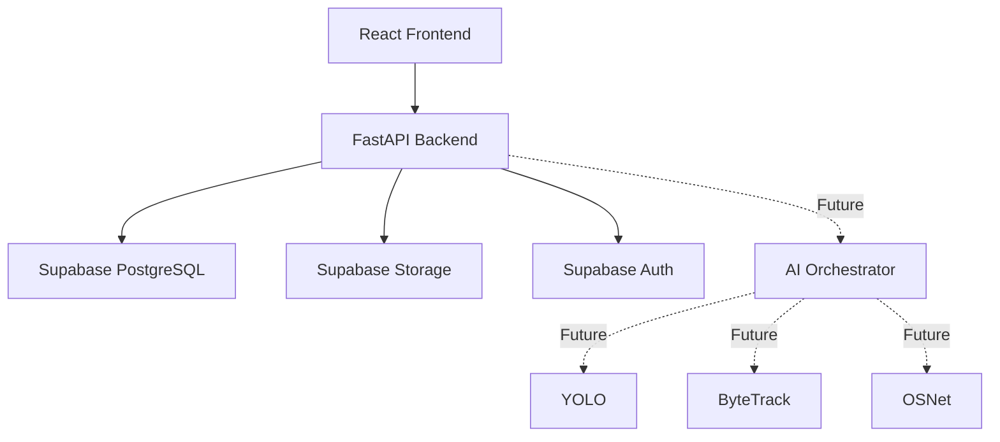

# FindSafe AI System Architecture

FindSafe AI is a privacy-conscious missing person detection, matching, and reunification platform engineered for authorized public-safety personnel.

## High-Level System Architecture

## Layer Breakdown

### 1. Frontend Layer
- **Framework**: React 18 + Vite + TypeScript.
- **Styling**: Tailwind CSS + Custom Design Tokens (Warm Khaki `#B85A1F` / Burnt Earth palette).
- **Navigation**: React Router v6 featuring authenticated AppLayout and responsive drawer sidebar.
- **State & Services**: Context API (`AuthContext`), Axios central client (`apiClient`), and feature services.
- **GIS Preparedness**: Leaflet & React Leaflet container setup.

### 2. Backend API Layer
- **Framework**: Python 3.11+ + FastAPI.
- **Configuration**: `pydantic-settings` reading `.env` configuration.
- **Database ORM & Supabase Client**: SQLAlchemy engine + native Supabase Python client wrapper with graceful unconfigured fallback.
- **Security & Authorization**: CORS origin constraints and Supabase Auth JWT verification dependencies.
- **Endpoints**: `GET /api/health` providing health metrics and Supabase connection status.

### 3. Database & Storage Layer (Supabase Cloud)
- **PostgreSQL**: Relational schema hosting missing person cases, candidate verifications, and audit trails.
- **Supabase Storage**: Secure object buckets for reference photos, video frames, and generated reports.
- **Supabase Auth**: JWT-based identity management. Service role key isolated strictly to backend execution.

### 4. Future AI Vision Architecture (Phase 3+)
- **YOLO**: Real-time object and person detection in CCTV feeds.
- **ByteTrack**: Multi-object tracking maintaining bounding box identities across video frames.
- **OSNet**: Person re-identification extracting deep visual feature vectors.
- **Evidence Fusion**: Spatial-temporal heuristics joining time, location, and visual match confidence.
